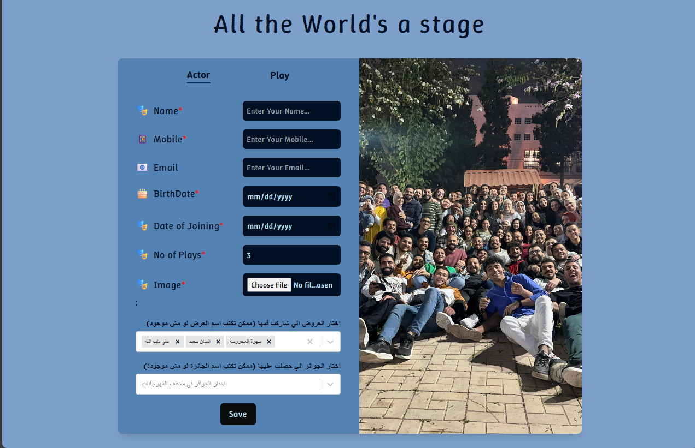

# 🎭 CastForm

CastForm is a theater festival management platform designed to streamline registration, evaluation, and award handling for university-level theatrical competitions. Built with a modern tech stack, it offers an intuitive interface for managing teams, submissions, and results.

🌐 [Live Website](https://castform-puce.vercel.app/)

📦 [GitHub Repository](https://github.com/georgegeham/castform)

⚒️ [Server Link](https://casthandasaserver-production.up.railway.app)

## 🚀 Features

- 📝 Team Registration Form with validation
- 🏆 Festival and Tournament Management
- 📊 Results Submission and Aggregation
- 🧑‍⚖️ Jury Panel Interface

---

## 📷 ScreenShot



---

## 🛠 Tech Stack

### Frontend:

- React
- TypeScript
- Tailwind CSS

### Backend:

- Node.js (Express)
- TypeScript
- MSSQL (Azure SQL Database)

### Deployment:

- Vercel (Frontend)
- Render (Backend API)
- Azure SQL (Database)

---

## 🔧 Installation

1. **Clone the repository:**

   ```bash
   git clone https://github.com/georgegeham/castform.git
   cd castform
   ```

2. **Setup Environment Variables:**

   ```bash
       DB_USER=your_db_user
       DB_PASSWORD=your_password
       DB_SERVER=your_sql_server.database.windows.net
       DB_DATABASE=your_database_name
       PORT=5050
   ```

3. **Install Dependencies:**

   ```bash
    npm install
   ```

4. **Run the project locally:**

   ```bash
       npm run dev
   ```
